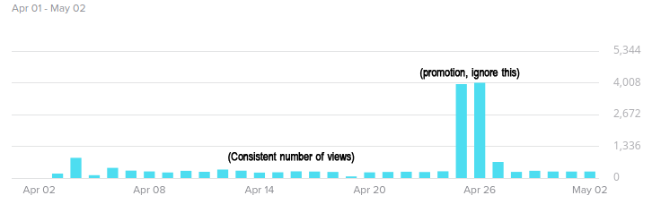
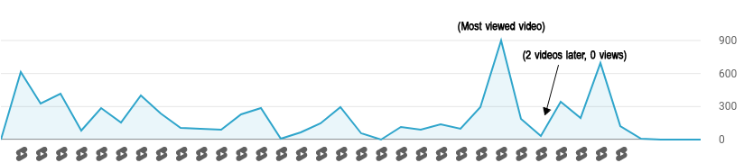
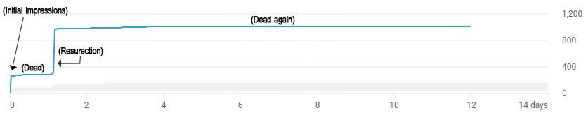

# I automated a YouTube channel using Python and AI

### The idea

**Would there be a relatively simple way to automate a YouTube channel?** 

That's the question that kept me up on a Friday night a couple of weeks ago. I couldn't resist the idea of spending the weekend creating a prototype.

To do this, I would need to 

- Establish a specific format to which all the videos would conform.
- Select a topic with which I am already familiar and comfortable.
- Find methods to automate all the assets, including scripts, videos, texts, etc.
- Figure out how to use an AI for the voice-over
- Automate the editing process
- Automatically upload the videos

The videos should be short and engaging since watch time is likely the most important metric for the YouTube algorithm.

I decided to create a channel centered around video game top fives, such as "Top 5 Best Indie Games on Nintendo Switch" or "Top 5 Best Open-World Games of all Time". The videos would be vertical and less than a minute long. This would allow me to upload them on TikTok too to compare the results. Every video would start with a brief intro, followed by an AI voice presenting the five games from #5 to #1 while gameplay footage would play in the background. The video would conclude with a call to action.

### The execution

In Python, I used OpenAPI’s API with a predefined prompt to write the video scripts to a text file. I manually modify the generated script when necessary. Then, I would feed the script to Microsoft Azure’s text-to-speech AI API to generate the voice-over, which I saved as .WAV files. To download gameplay footage for each game, I used a library called [yt_dlp](https://github.com/yt-dlp/yt-dlp). I automated the editing process, added royalty-free music, and merged everything together using the [MoviePy](https://github.com/Zulko/moviepy) library.

I managed to achieve almost everything I wanted during the first two weekends. My strategy was to gradually improve the code and add new features every time I would generate a new video over the next month. You can clearly see the quality of the video improve over time when watched in order. However, I had to make some compromises for the sake of time, particularly with automating the uploading process. Currently, it takes me about 5 minutes in total to upload a video to YouTube and TikTok. Automating this process would have likely taken me a couple of hours. This is my next objective for future development of this project.

Starting from scratch, the entire process of creating the script, generating the video, and uploading it on YouTube and TikTok takes me approximately 30 minutes in total. The majority of this time is spent on adjusting the generated video script. Although there are still areas where I could further improve and streamline the process, I can assure you that reaching this point was already quite challenging.

### The problems and limitations

Automatically downloading videos seemed easy at first, but I quickly encountered a pretty big issue. While downloading any video worked well, downloading a GOOD video did not. Downloading a video based on search terms was much to random and inconsistent. Let’s say that I want to show some gameplay of Minecraft. Ideally, I would want to show someone building an impressive construction or fighting the ender dragon rather than showing someone mindlessly digging dirt blocks. I decided to solve this problem by incorporating some manual work into the process by specifying YouTube URLs and timestamps myself in the video script to ersure that I would always have usable gameplay footage. Although it requires more time and effort on my part and somewhat ruins the concept of 'Automating a YouTube channel', the outcome is significantly improved.

When using a conventional video editing software, simple things are usually effortless. However, when editing a video using code, theses simple things can be significantly more challenging. For example, I decided to put some shadow beneath the yellow text since it was sometime hard to read over the gameplay footage. In any good video editing software, this would have taken a click or two, but this took me multiple hours of trial and errors to find a solution.

When I finally was happy with the results and wanted to upload the first video to YouTube, I faced a really weird problem. The uploaded version of the video was completely broken. Everything was looking green and glitchy. I couldn’t find anyone having a similar problem online. This was not happening on my computer, nor on TikTok. It seemed to be some kind of encoding problem, even though I was using all the recommended settings by YouTube on there troubleshooting page. I fixed that problem by changing some settings (pretty much randomly) when exporting the video. To this day, I still have some compression problems when uploading the video. The videos always look much better on my computer then on YouTube and TikTok.

I was using OpenAPI’s API to come up with the script of the video. I came up with a prompt that would get a pretty consistent answers from the AI. Although I would sometime need to manually tweak the script a bit, I was usually pretty satisfied with the results. But, GPT 3.5 is is stuck in 2021, which is a problem when I want to include games that came out in 2022 or 2023. I tried using Bing’s chat for those specific games, but the generated text is usually way too long and specific and the results were needing much more manual tweaking. I do not have a solution for this yet.

### The result

By now, you must be curious about the outcome. Check out one of the videos: [https://www.youtube.com/shorts/5qdWeAe2D94](https://www.youtube.com/shorts/5qdWeAe2D94) 

I created A YouTube and a TikTok channel called ***Some Top Fives With Lucas***. You can take a look at them [here](https://www.youtube.com/@SomeTopFivesWithLucas) and [here](https://www.tiktok.com/@sometopfiveswithlucas).

I uploaded a video every single day from April 2nd to May 2nd for a total of **31 videos**. Let’s take a look at the numbers (as of May 27th 2023):

**YouTube**:

- 7.1K views in total
- 196 total likes
- 45.0 hours of watch time
- 18 subscribers
- Most watched video: “Top 5 Best Zelda Games of All Time” with 1014 views and 39 likes.
- 6.8k unique Viewers

**TikTok:**

- 17.1k views in total
- 954 total likes
- 62 subscribers
- 50 comments
- Most watched video: “Top 5 Most Addicting Games” with 830 views and 120 likes.

There seems to be a clear winner right? Well, it’s complicated… I kind of cheated on TikTok. I wanted to know if paying to promote a video would have an impact on the channel. I decided to pay a total of $30 to promote a video ($15 each day for 2 days). I did gain roughly 30 subscribers and the video got 12.8k views instead of the ~250 views the other videos would usually get. Although it had an impact on the video itself, I did not see any significant changes in the overall channel numbers. If we exclude this video from the total, TikTok got around 4.3k total views, which is less than YouTube. However, the videos would usually get a much better engagement (likes, comments, favorites, etc.) per view compared to YouTube. The way people consume the content on each platform seems to be very different.

As mentioned, the videos on TikTok usually get around 250 views. On Youtube, a video could get 600 views, while the next one might get 0 views. This inconsistency seems rather strange to me, especially considering that all the videos have the same format and revolve around very similar topics.

**Views per day on TikTok**:

**Views per day on YouTube:**

On TikTok, I would typically receive a few views per hour for 12-20 hours until the video reaches around 250 views. On Youtube, All the views would come in the first 2 hours after uploading, then the video would die and no longer get any impressions in the feeds. In rare cases, the video would resurrect after a couple hours, gets tons of impressions then die again. The TikTok algorithm was much more consistent with my uploads.

**Impressions in YouTube feed:**

Based on theses numbers, **what platform would I recommend uploading your short-form videos to?** Well, both. I really don’t see any reason to chose one or the other right now. I would even encourage you to diversify even more with other platforms like Instagram Reels, Snapchat, etc.

### Conclusion

For better or for worst, I believe we will see tons of automated channels in the future. There are already numerous examples of them in the wild. While some of them are clearly designed as money-generating machines, I genuinely believe there can be a place for ethically created AI-based automated content out there.

I know this idea of automating a youtube channel with AI is not unique or extraordinary, but it sounded like a fun challenge and a great learning opportunity. I did learn quite a lot working on this project. I’m glad that I started working on it very spontaneously instead of overthinking it. 

This is my first blog article, so I am seeking some constructive feedback. Thank you for reading!